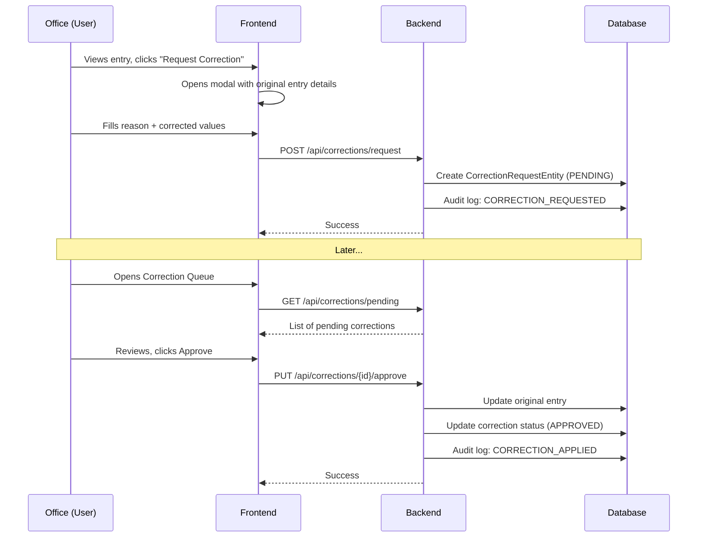
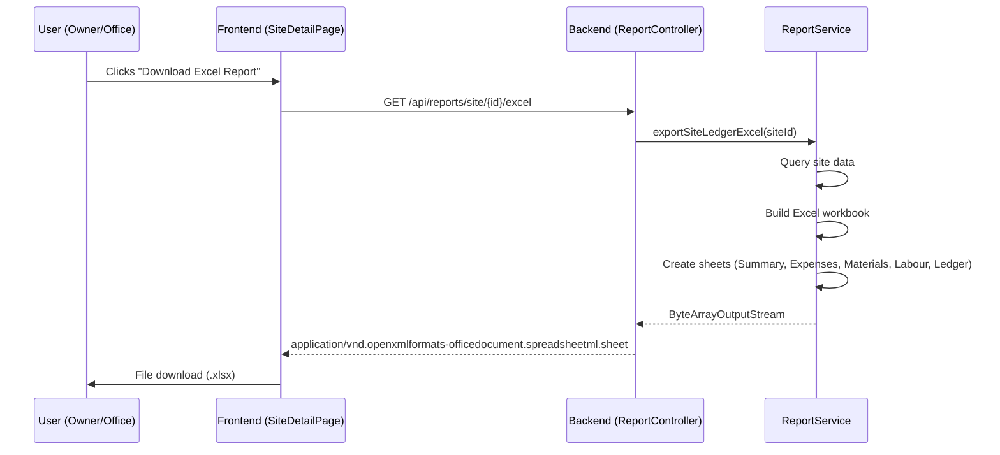

# Implementation Plan: Correction Workflow + Reports Export

---

## Part 1: Correction Workflow

### BRD Reference
**Section 5.1** — Office Module > Corrections  
> Systematic correction workflow: View original entry → Make correction → Log reason → Audit trail  

**Section 5.2** — Verification Workflow  
> Request Correction → Staff/Admin corrects

### Architecture

```
                   ┌───────────────────┐
                   │  Original Entry    │
                   │  (Labour/Expense)  │
                   └────────┬──────────┘
                            │
                   ┌────────▼──────────┐
                   │ Office clicks      │
                   │ "Request Correction"│
                   └────────┬──────────┘
                            │
                   ┌────────▼──────────┐
                   │ Create Correction  │
                   │ Request in DB     │
                   │ Status: PENDING   │
                   └────────┬──────────┘
                            │
         ┌──────────────────┼──────────────────┐
         │                  │                   │
         ▼                  ▼                   ▼
   ┌──────────┐     ┌──────────────┐    ┌──────────┐
   │ OWNER    │     │ SITE_INCHARGE│    │  MUNSHI  │
   │ Corrects │     │  Corrects    │    │(view only)│
   └────┬─────┘     └──────┬───────┘    └──────────┘
        │                  │
        ▼                  ▼
   ┌─────────────────────────────┐
   │  Correction Applied         │
   │  • Entry updated            │
   │  • Audit log created        │
   │  • Correction req resolved  │
   │  • Original preserved in    │
   │    audit trail              │
   └─────────────────────────────┘
```

### Files to Create

#### 1. CorrectionRequestEntity.java (NEW)
```java
@Entity
@Table(name = "correction_requests")
public class CorrectionRequestEntity {
    Long id;
    String entityType;       // LABOUR, EXPENSE, MATERIAL, TRANSPORT, etc.
    Long entityId;           // The entry that needs correction
    Long siteId;
    String requestedBy;      // Office username
    String correctionReason; // Why correction needed
    String originalSnapshot; // JSON snapshot of original values
    String correctionDetails;// JSON of proposed changes
    CorrectionStatus status; // PENDING, APPROVED, REJECTED
    String resolvedBy;
    LocalDateTime resolvedAt;
    LocalDateTime createdAt;
    LocalDateTime updatedAt;
    
    enum CorrectionStatus { PENDING, APPROVED, REJECTED }
}
```

#### 2. CorrectionService.java (NEW)
Methods:
- `requestCorrection(entityType, entityId, reason, requestedBy)` → create correction request
- `getPendingCorrections(siteId)` → get all pending for a site
- `getAllPendingCorrections()` → get all pending across all sites (for Office)
- `approveCorrection(requestId, resolvedBy)` → apply the correction + audit log
- `rejectCorrection(requestId, reason, resolvedBy)` → reject with reason
- `getCorrectionHistory(entityType, entityId)` → full correction history for an entry

#### 3. CorrectionController.java (NEW)
Endpoints:
- `POST /api/corrections/request` — Office requests correction
- `GET /api/corrections/pending?siteId=X` — Get pending corrections
- `PUT /api/corrections/{id}/approve` — Approve + apply correction
- `PUT /api/corrections/{id}/reject` — Reject correction
- `GET /api/corrections/history/{entityType}/{entityId}` — History

#### 4. CorrectionRequestRepository.java (NEW)

#### 5. CorrectionPage.jsx (NEW frontend page)
- Shows pending corrections in a queue
- For each: Show original entry snapshot → Show proposed correction → Approve/Reject
- Office can view correction history per entry
- Add link in navigation for Office/OWNER

#### 6. CorrectionApi.js (NEW frontend API)

### Files to Modify

#### 7. App.jsx — Add route for correction page
- `/corrections` → `CorrectionPage.jsx`
- Add sidebar link for Office/OWNER

#### 8. Layout.jsx — Add sidebar navigation item

#### 9. SiteDetailPage.jsx — Add "Request Correction" button on entries
- On each entry (expense, labour, material, transport), add a "Request Correction" button for Office users
- Opens a modal with reason field

---

## Part 2: Reports Export (Excel + PDF)

### BRD Reference
**Section 10.2** Tab 10 — Reports > "Exportable reports"  
**Section 4.1** — Reports > "Exportable reports with charts, site-wise profit/loss"

### Architecture

```
┌──────────────┐     ┌──────────────┐     ┌──────────────┐
│ Report       │────▶│ Excel Export  │────▶│ .xlsx file   │
│ Controller   │     │ (Apache POI)  │     │ Download     │
├──────────────┤     ├──────────────┤     ├──────────────┤
│              │     │ PDF Export   │     │ .pdf file    │
│              │     │ (iText)      │     │ Download     │
└──────────────┘     └──────────────┘     └──────────────┘
```

### Files to Create

#### 1. ReportService.java (NEW)
Methods:
- `exportSiteLedgerExcel(siteId, response)` — Site ledger as Excel
- `exportSiteLedgerPdf(siteId, response)` — Site ledger as PDF
- `exportExpenseSummaryExcel(siteId, response)` — Expense breakdown Excel
- `exportExpenseSummaryPdf(siteId, response)` — Expense breakdown PDF
- `exportMonthlyWageSheetExcel(siteId, month, response)` — Wage sheet Excel
- `exportFullReportExcel(siteId, response)` — Complete site report

**Excel (Apache POI)** — Already in pom.xml:
- Sheet 1: Site KPIs (Contract Value, Received, Expense, Profit, Pending, Progress)
- Sheet 2: Expense Summary by Category
- Sheet 3: Material Summary
- Sheet 4: Labour Summary
- Sheet 5: All Ledger Entries

**PDF (iText)** — Need to add dependency:
```xml
<dependency>
    <groupId>com.itextpdf</groupId>
    <artifactId>itext7-core</artifactId>
    <version>8.0.4</version>
    <type>pom</type>
</dependency>
```
OR use OpenPDF (lighter):
```xml
<dependency>
    <groupId>com.github.librepdf</groupId>
    <artifactId>openpdf</artifactId>
    <version>2.0.3</version>
</dependency>
```

#### 2. ReportController.java (NEW)
Endpoints:
- `GET /api/reports/site/{siteId}/excel` — Download site report as Excel
- `GET /api/reports/site/{siteId}/pdf` — Download site report as PDF
- `GET /api/reports/site/{siteId}/expenses/excel` — Expense report Excel
- `GET /api/reports/site/{siteId}/expenses/pdf` — Expense report PDF
- `GET /api/reports/site/{siteId}/wages/excel?month=2026-06` — Wage sheet Excel

#### 3. ReportApi.js (NEW frontend API)

### Files to Modify

#### 4. SiteDetailPage.jsx (line 903-911)
Replace the "Coming Soon" placeholder with actual export buttons:
- "📥 Download Excel Report" button
- "📥 Download PDF Report" button
- "📥 Download Expense Summary (Excel)" button

#### 5. pom.xml — Add OpenPDF or iText dependency

### Report Content Details

**Excel Report — "Site Ledger Report - [Site Name]"**
| Sheet | Content |
|-------|---------|
| 1. Summary | Contract Value, Received, Expense, Profit/Loss, Pending, Progress % |
| 2. Expenses | Category-wise breakdown with drill-down data |
| 3. Materials | Stock list with purchased/shifted/consumed/balance |
| 4. Labour | Registrations, monthly wage summary |
| 5. Ledger | All ledger entries (date, particulars, category, amount, type) |

**PDF Report — "Site Ledger Report - [Site Name]"**
- Header with site name and generated date
- KPI cards in a table
- Expense breakdown table
- Material summary table
- Footer with generated by info

---

## Implementation Order

### Step 1: Correction Workflow Backend
- Create `CorrectionRequestEntity.java`
- Create `CorrectionRequestRepository.java`
- Create `CorrectionService.java`
- Create `CorrectionController.java`

### Step 2: Correction Workflow Frontend
- Create `correctionApi.js`
- Create `CorrectionPage.jsx`
- Modify `App.jsx` (route + sidebar)
- Modify `SiteDetailPage.jsx` (add "Request Correction" button)

### Step 3: Reports Backend
- Add OpenPDF dependency to `pom.xml`
- Create `ReportService.java` (Excel + PDF generation)
- Create `ReportController.java`

### Step 4: Reports Frontend
- Create `reportApi.js`
- Modify `SiteDetailPage.jsx` (replace placeholder with export buttons)

---

## Sequence Diagram: Correction Workflow



## Sequence Diagram: Report Export


